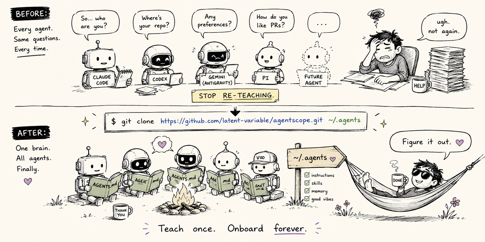

<div align="center">



# agentscope

**teach your agents once. all of them. forever.**

One brain every agent CLI reads, Claude Code, Codex, Antigravity, Pi. Clone it, let it onboard you, never re-explain yourself again.

[Install](#install) · [Onboarding](#onboarding) · [What's inside](#whats-inside) · [How it wires](#how-each-tool-gets-wired)

</div>

---

You bought four coding agents and every one of them has amnesia. New session, day one, every time. Who are you. How do you like your commits. Where do your repos live. Don't use em-dashes. Use `trash`, not `rm`. You type the same speech into Claude, then into Codex, then into Gemini, then into Pi, and tomorrow you do it again.

The agents aren't the problem. They're plenty smart. We just keep each one in a little padded cell, no windows, no shared notebook, gently forbidden from learning a single thing from the agent sitting right next to it. They could pool what they know about you in an afternoon. We never hand them the folder.

**agentscope is the folder.** One directory at `~/.agents`: your identity, your writing rules, your workflow, your reusable skills, your memory. Every agent CLI symlinks to it and reads the same thing. Edit it once, all of them update. Learn something new about how you work, write it down once, all of them remember. It's the most obvious idea in the world, which is exactly why nobody shipped it.

## Install

```bash
git clone https://github.com/latent-variable/agentscope.git ~/.agents
```

That's the whole install. The wiring happens next, and you don't do it by hand.

## Onboarding

Open any agent CLI and say:

> **"Onboard me with agentscope."**

It runs the **`onboarding`** skill: a two-minute interview (who you are, where your code lives, how you like to be talked to), then it fills in the template, finds every agent CLI you have installed, and wires them all to `~/.agents`. You answer six questions. It does the plumbing.

Want to do it by hand instead? `~/.agents/bin/sync.sh` lays the symlinks; edit `AGENTS.md` and `memory/user_profile.md` yourself. Same destination, more typing.

## What's inside

```
~/.agents/
  AGENTS.md     # your global instructions (identity is a fill-in-the-blank template)
  skills/       # portable SKILL.md skills, loaded on demand by name
  memory/       # durable cross-agent facts; read MEMORY.md first
  bin/sync.sh   # idempotent installer, points each tool's native paths here
  bin/verify.sh # drift detector, flags stale paths so an agent self-corrects
```

**Skills it ships with:** `onboarding` (the setup interview), `remember` (any agent writes a fact, all of them inherit it), `self-correct` (canon repairs itself when reality drifts), `project-scope` (per-repo agent context), `review-cycle` (branch, PR, review, merge), `eli5` (plain-language explanations on demand), `pull-requests`, `draft-response`, `security-audit`.

## How each tool gets wired

| Tool | Instructions → `AGENTS.md` | Skills | Memory |
|------|----------------------------|--------|--------|
| Claude Code | `~/.claude/CLAUDE.md` | `~/.claude/skills/*` | `~/.claude/projects/<home>/memory` → `~/.agents/memory` |
| Codex | `~/.codex/AGENTS.md` | `~/.codex/skills/*` | via AGENTS.md pointer |
| Antigravity (Gemini) | `~/.gemini/GEMINI.md` + `AGENTS.md` | `~/.gemini/skills/*` | via AGENTS.md pointer |
| Pi | `~/.pi/agent/AGENTS.md` | reads `~/.agents/skills/` natively | via AGENTS.md pointer |

`sync.sh` only wires the tools it actually finds. Install a new agent next month, re-run it, done. It's idempotent, so spamming it is harmless.

## It keeps itself honest

Tell an agent your project moved and the old path is still sitting in canon? The **`self-correct`** skill catches that mid-task, fixes the source, and pushes, so the other three agents never trip on the stale fact. One agent's correction becomes everyone's. Drift detector lives at `bin/verify.sh` if you'd rather run it on a schedule.

## Optional: make your agent talk to you

If you'd rather *hear* what your agent did than read it, turn on the **🔊 Speak to me** convention during onboarding: every reply ends with a few plain spoken sentences, written to be heard, not skimmed. Pair it with **[Yap](https://github.com/latent-variable/Yap)**, local-first on-device text-to-speech for macOS, and your agent literally briefs you out loud while you stare out the window. macOS only for now.

## The one honest seam

Reading is instant and shared (symlinks). **Writing back** isn't fully solved yet: Claude Code's auto-memory writes straight into `~/.agents/memory/`, but the other tools mostly read. When they learn something durable, they use the `remember` skill to drop it in by hand. True multi-agent memory write-back isn't a standard anyone's nailed. This is the pragmatic version that works today.

## License

MIT. Take it, fork it, make your agents less forgetful.
