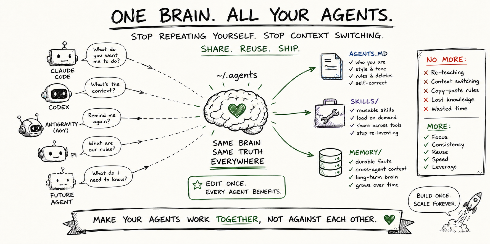
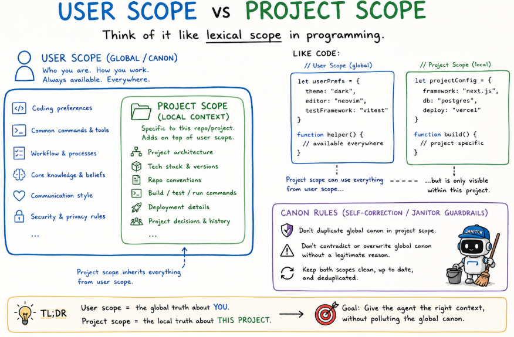

<div align="center">



# userscope

**teach your agents once. all of them. forever.**

One brain every agent CLI reads, Claude Code, Codex, Antigravity, Pi. Clone it, let it onboard you, never re-explain yourself again.

[Install](#install) · [Why "userscope"](#why-userscope) · [Onboarding](#onboarding) · [What's inside](#whats-inside) · [How it wires](#how-each-tool-gets-wired)

</div>

---

You bought four coding agents and every one of them has amnesia. New session, day one, every time. Who are you. How do you like your commits. Where do your repos live. Don't use em-dashes. Use `trash`, not `rm`. You type the same speech into Claude, then into Codex, then into Gemini, then into Pi, and tomorrow you do it again.

The agents aren't the problem. They're plenty smart. We just keep each one in a little padded cell, no windows, no shared notebook, gently forbidden from learning a single thing from the agent sitting right next to it. They could pool what they know about you in an afternoon. We never hand them the folder.

**userscope is the folder.** One directory at `~/.agents`: your identity, your writing rules, your workflow, your reusable skills, your memory. Every agent CLI symlinks to it and reads the same thing. Edit it once, all of them update. Learn something new about how you work, write it down once, all of them remember. It's the most obvious idea in the world, which is exactly why nobody shipped it.

## Install

```bash
git clone https://github.com/latent-variable/userscope.git ~/.agents
```

That's the whole install. The wiring happens next, and you don't do it by hand.

## Why "userscope"

It's lexical scope, borrowed. **User scope** is the global truth about *you*, visible everywhere. **Project scope** is the local truth about *this repo*, visible only inside it, and it inherits everything from above.



That split is the whole design. Your commit style, your delete-safely rule, your writing voice: those are yours, so they live once at `~/.agents` and every repo inherits them. A repo's build command, its deploy gate, its one weird architectural decision: those are local, so they live in the repo and never leak upward. The `project-scope` skill wires the local half; `bin/project-sync.sh` bootstraps it in one command.

Get it backwards and you get the two failure modes this repo exists to prevent: global canon pasted into thirty repos where it quietly goes stale, or a project's quirk promoted to global truth and applied where it's wrong.

## Onboarding

Open any agent CLI and say:

> **"Onboard me with userscope."**

It runs the **`onboarding`** skill: a two-minute interview (who you are, where your code lives, how you like to be talked to), then it fills in the template, finds every agent CLI you have installed, and wires them all to `~/.agents`. You answer six questions. It does the plumbing.

Want to do it by hand instead? `~/.agents/bin/sync.sh` lays the symlinks; edit `AGENTS.md` and `memory/user_profile.md` yourself. Same destination, more typing.

## What's inside

```
~/.agents/
  AGENTS.md     # your global instructions (identity is a fill-in-the-blank template)
  skills/       # portable SKILL.md skills, loaded on demand by name
  memory/       # durable cross-agent facts; read MEMORY.md first
  bin/sync.sh   # idempotent installer, points each tool's native paths here
  bin/project-sync.sh # bootstrap project scope in a repo
  bin/verify.sh # drift detector, flags stale paths so an agent self-corrects
  bin/canon-size.sh # meters the context every agent pays on EVERY turn
  bin/canon-dupe    # finds the same rule stated twice, and rules that contradict
  bin/canon-echo.sh # flags canon restated inside a repo, before it goes stale
```

**Skills it ships with:** `onboarding` (the setup interview), `remember` (any agent writes a fact, all of them inherit it), `self-correct` (canon repairs itself when reality drifts), `cleanup` (deliberate consistency sweep across every layer), `project-scope` (per-repo agent context).

### What this repo deliberately does not ship

No worktree helper, no ticket-board CLI, no review workflow, no writing-voice skill. Those are *your* working style, and mine would be wrong for you.

What is here is the part that generalises: **one brain, shared by every agent CLI you use, that stays honest as it grows.** The four `bin/` tools above exist because a shared brain has exactly one failure mode — it rots. It accumulates rules nobody removes, the same rule written down three times in three files, and prose that quietly costs you tokens on every single turn. Those tools measure that, so you can act on it before an agent acts on a stale rule.

Build your own workflow skills on top. That is the whole point of `skills/`.

## How each tool gets wired

| Tool | Instructions → `AGENTS.md` | Skills | Memory |
|------|----------------------------|--------|--------|
| Claude Code | `~/.claude/CLAUDE.md` | `~/.claude/skills/*` | `~/.claude/projects/<home>/memory` → `~/.agents/memory` |
| Codex | `~/.codex/AGENTS.md` | `~/.codex/skills/*` | via AGENTS.md pointer |
| Antigravity (Gemini) | `~/.gemini/GEMINI.md` | `~/.gemini/skills/*` | via AGENTS.md pointer |
| Pi | `~/.pi/agent/AGENTS.md` | `~/.pi/agent/skills/*` | via AGENTS.md pointer |

`sync.sh` only wires the tools it actually finds. Install a new agent next month, re-run it, done. It's idempotent, so spamming it is harmless.

## It keeps itself honest

Tell an agent your project moved and the old path is still sitting in canon? The **`self-correct`** skill catches that mid-task, fixes the source, and pushes, so the other agents never trip on the stale fact. One agent's correction becomes everyone's. Drift detector lives at `bin/verify.sh` if you'd rather run it on a schedule.

The harder version of the same problem: a rule is usually written down in four places, and changing one is how every drift starts. Prose in `AGENTS.md`, a fact in `memory/`, a step in a skill, an assertion in `bin/verify.sh`. The **`cleanup`** skill is the deliberate sweep for that, and it's why `verify.sh` failing is treated as an emergency rather than background noise. A permanently-red checker teaches everyone to ignore it.

## Optional: make your agent talk to you

If you'd rather *hear* what your agent did than read it, turn on the **🔊 Speak to me** convention during onboarding: every reply ends with a few plain spoken sentences, written to be heard, not skimmed. Pair it with **[Yap](https://github.com/latent-variable/Yap)**, local-first on-device text-to-speech for macOS, and your agent literally briefs you out loud while you stare out the window. macOS only for now.

## Memory: shared reads, discretionary writes

Every agent reads the same `~/.agents/memory/` instantly through symlinks, and every agent can **write** to it too, via the `remember` skill (write the fact, index it in `MEMORY.md`, commit). Write-back works across all of them today.

The one asymmetry: Claude Code captures memories automatically in the background, while Codex, Gemini, and Pi write when they judge a fact worth keeping. That automatic capture is a per-vendor harness feature; a shared folder can't inject it, and no cross-tool standard for it exists yet. This is fine by design. Reads are shared, the primary agent does most of the capturing, and the others stay read-mostly, writing only what clearly matters. Memory is kept compact and self-correcting: agents update an existing note rather than pile new ones on, so the shared brain never bloats.

> Renamed from `agentscope` in August 2026, to stop colliding with the [unrelated multi-agent framework](https://github.com/agentscope-ai/agentscope) of the same name. Old clone URLs still redirect.

## License

MIT. Take it, fork it, make your agents less forgetful.
